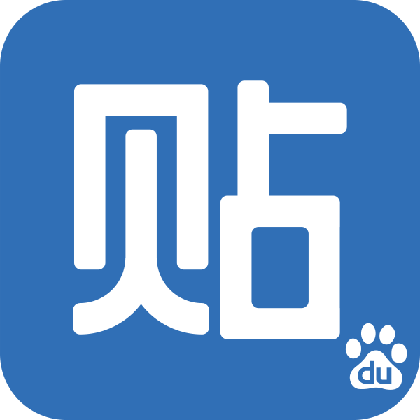

&nbsp;

<p align="center">
  
</p>
<p align="center">
   <b>TiebaSign</b>&nbsp;
</p>

&nbsp;

### 使用说明

> - 登录贴吧，然后按下 `<F12>` 打开调试模式，在 `<cookie>` 中找到 `<BDUSS>`，并复制其 `<Value>` 值
> - 每 5 天的 02:50 清理一次日志 `50 2 */5 * * find /scripts/logs -name '*.log' | xargs rm -rf`
> - 每 1 天的 05:20 贴吧自动签到 `20 5 * * * python /scripts/main.py`
> - 支持同时添加多个帐户，BDUSS 之间用 `#` 隔开即可

### 容器部署

> `docker-compose.yml`

```yml
version: '3'
services:
  tieba-sign:
    image: xtoys/tieba-sign:latest
    container_name: tieba-sign
    network_mode: bridge
    hostname: tieba-sign
    restart: unless-stopped
    environment:
      - BDUSS="xxxxxxxxx#zzzzzzzzz" # 多个帐户之间用 # 隔开即可
```
